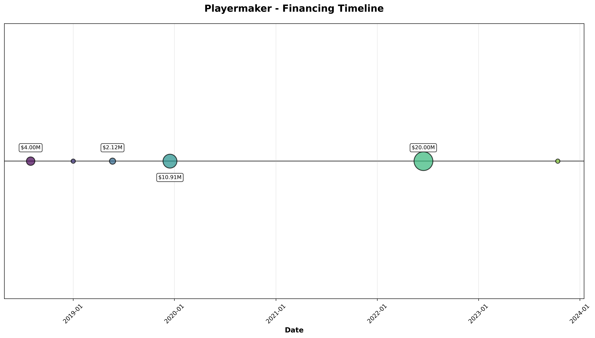

# Appendix 8: Playermaker

**Company ID**: 142343-92
**Visualization**:

---

## A8.1 Company Overview

| Attribute | Value |
|-----------|-------|
| **Company Name** | Playermaker |
| **Year Founded** | 2016 |
| **Current Age** | 8 years (as of 2024)
| **Industry** | Consumer Durables |
| **Headquarters** | London, United Kingdom |
| **Website** | www.playermaker.com |
| **Employees** | 76 (as of 03/05/2025) |

**Description**: Operator of a coaching enhancement kit brand intended for football players. The company offers a wearable performance-tracking device that turns footwear into a connected device that captures technical, tactical, biomechanical and physical data from the source of motion, enabling athletes at any level to maximize their skills, monitor injury risk, as well as expedite injury recovery.

---

## A8.2 Financing Summary

| Metric | Value |
|--------|-------|
| **First Financing Date** | N/A |
| **Time to First Financing** | N/A |
| **First Deal Type** | Later Stage VC |
| **First Deal Size** | $2.97M
| **Total Capital Raised** | $40.00M
| **Number of Rounds** | 7 |
| **Current Status** | Venture Capital-Backed |
| **Business Status** | Generating Revenue |

---

## A8.3 Financing History

| Round | Date | Deal Type | Deal Class | Amount | Pre-Money | Post-Money |
|-------|------|-----------|------------|---------|-----------|------------|
| 1 | N/A | Later Stage VC | Venture Capital | $2.97M | N/A | N/A |
| 2 | 08/01/2018 | Early Stage VC | Venture Capital | $4.00M | $12.11M | $16.11M |
| 3 | 01/01/2019 | Accelerator/Incubator | Other | N/A | N/A | N/A |
| 4 | 05/23/2019 | Early Stage VC | Venture Capital | $2.12M | $19.34M | $21.46M |
| 5 | 12/16/2019 | Early Stage VC | Venture Capital | $10.91M | $35.09M | $46.00M |
| 6 | 06/16/2022 | Later Stage VC | Venture Capital | $20.00M | $59.30M | $79.30M |
| 7 | 10/13/2023 | Later Stage VC | Venture Capital | N/A | N/A | N/A |

---

## A8.4 Valuation

| Metric | Value |
|--------|-------|
| **First Valuation** | $16.11M
| **Last Known Valuation** | $79.30M
| **Last Valuation Date** | 06/16/2022 |

---

## A8.5 Exit Events

| Attribute | Value |
|-----------|-------|
| **Exit Event** | No |
| **Exit Details** |  |
| **Ownership Status** | Privately Held (backing) |

---

## A8.6 Investment & Acquisition Activity

| Attribute | Value |
|-----------|-------|
| **Active as Investor/Acquirer** | No |

---

## A8.7 Key Investors

| Investors (by round) |
|---------------------|
| 1 |
| 2 |
| 3 |
| 4 |
| 5 |
| 6 |
| 7 |

*Data extracted: December 02, 2025*