## Table of Contents

- **Appendix 01**: Catapult Sports
- **Appendix 02**: Empatica
- **Appendix 03**: Fitbit
- **Appendix 04**: Flow Neuroscience
- **Appendix 05**: GOQii
- **Appendix 06**: Oura
- **Appendix 07**: Peloton
- **Appendix 08**: Playermaker
- **Appendix 09**: Pulsetto
- **Appendix 10**: ThingX
- **Appendix 11**: Ultrahuman
- **Appendix 12**: Whoop
- **Appendix 13**: Zepp Health

# Appendix 1: Catapult Sports

**Company ID**: 56236-96
**Visualization**:

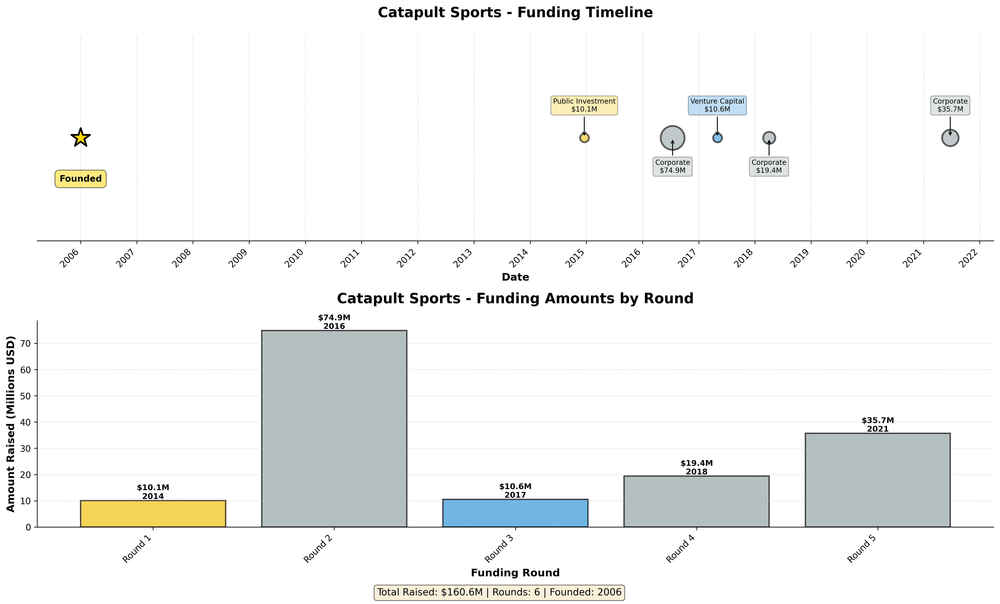

---

## A1.1 Company Overview

| Attribute | Value |
|-----------|-------|
| **Company Name** | Catapult Sports |
| **Year Founded** | 2006 |
| **Current Age** | 18 years (as of 2024) |
| **Industry** | Healthcare Devices and Supplies |
| **Headquarters** | Melbourne, Australia |
| **Website** | www.catapult.com |
| **Employees** | 430 (as of 03/30/2024) |

**Description**: Developer of wearable technology products designed to advance athlete performances.

---

## A1.2 Financing Summary

| Metric | Value |
|--------|-------|
| **First Financing Date** | N/A |
| **Time to First Financing** | N/A |
| **First Deal Type** | Early Stage VC |
| **First Deal Size** | $10.0M |
| **Total Capital Raised** | $160.6M |
| **Number of Rounds** | 6 |
| **Current Status** | Formerly Angel backed |
| **Business Status** | Generating Revenue/Not Profitable |

---

## A1.3 Financing History

| Round | Date | Deal Type | Deal Class | Amount | Pre-Money | Post-Money |
|-------|------|-----------|------------|---------|-----------|------------|
| 1 | N/A | Early Stage VC | Venture Capital | $10.0M | N/A | N/A |
| 2 | 12/19/2014 | IPO | Public Investment | $10.1M | $45.5M | $55.6M |
| 3 | 07/15/2016 | PIPE | Corporate | $74.9M | N/A | N/A |
| 4 | 05/02/2017 | PIPE | Venture Capital | $10.6M | N/A | N/A |
| 5 | 04/03/2018 | PIPE | Corporate | $19.4M | N/A | N/A |
| 6 | 06/24/2021 | PIPE | Corporate | $35.7M | N/A | N/A |

---

## A1.4 Valuation

| Metric | Value |
|--------|-------|
| **First Valuation** | N/A |
| **Last Known Valuation** | $55.6M |
| **Last Valuation Date** | 12/19/2014 |

---

## A1.5 Exit Events

| Attribute | Value |
|-----------|-------|
| **Exit Event** | Yes (IPO) |
| **Exit Details** | ASX: CAT |
| **Ownership Status** | Publicly Held |

---

## A1.6 Investment & Acquisition Activity

| Attribute | Value |
|-----------|-------|
| **Active as Investor/Acquirer** | Yes (Investor) |
| **Summary** | 5 investments,  active, 1 acquisitions |
| **Investor Type** | Corporation |
| **Total Investments** | 5 |
| **Active Portfolio** |  companies |
| **Last Investment** | SBG Sports Software (06/23/2021) |

### Acquisitions Made (Top 10)

| # | Target Company | Date | Amount |
|---|----------------|------|--------|
| 1 | XOS Digital | 08/11/2016 | $80.0M |

---

## A1.7 Key Investors

| Investors (by round) |
|---------------------|
| 3 |
| 2 |

---

# Appendix 2: Empatica

**Company ID**: 107433-19
**Visualization**:

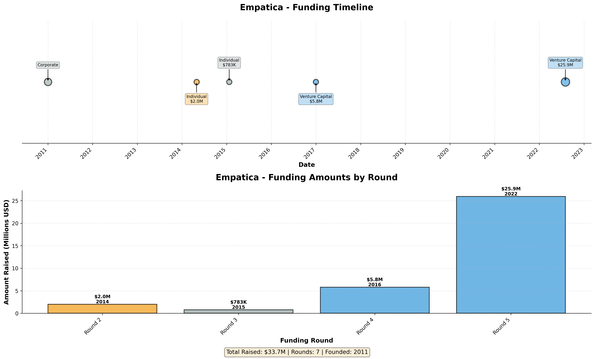

---

## A2.1 Company Overview

| Attribute | Value |
|-----------|-------|
| **Company Name** | Empatica |
| **Year Founded** | 2011 |
| **Current Age** | 13 years (as of 2024) |
| **Industry** | Healthcare Devices and Supplies |
| **Headquarters** | Cambridge, MA |
| **Website** | www.empatica.com |
| **Employees** | 116 (as of 04/01/2025) |

**Description**: Developer of medical wearable devices designed for health monitoring, forecasting, treatment, and research.

---

## A2.2 Financing Summary

| Metric | Value |
|--------|-------|
| **First Financing Date** | 01/01/2011 |
| **Time to First Financing** | 1 months |
| **First Deal Type** | University Spin-Out |
| **First Deal Size** | N/A |
| **Total Capital Raised** | $33.7M |
| **Number of Rounds** | 7 |
| **Current Status** | Venture Capital-Backed |
| **Business Status** | Generating Revenue |

---

## A2.3 Financing History

| Round | Date | Deal Type | Deal Class | Amount | Pre-Money | Post-Money |
|-------|------|-----------|------------|---------|-----------|------------|
| 1 | N/A | Accelerator/Incubator | Other | N/A | N/A | N/A |
| 2 | N/A | Accelerator/Incubator | Other | N/A | N/A | N/A |
| 3 | 01/01/2011 | University Spin-Out | Corporate | N/A | N/A | N/A |
| 4 | 04/30/2014 | Seed Round | Individual | $2.0M | N/A | N/A |
| 5 | 01/22/2015 | Product Crowdfunding | Individual | $783K | N/A | N/A |
| 6 | 12/31/2016 | Later Stage VC | Venture Capital | $5.8M | N/A | N/A |
| 7 | 08/02/2022 | Later Stage VC | Venture Capital | $25.9M | N/A | N/A |

---

## A2.4 Valuation

| Metric | Value |
|--------|-------|
| **First Valuation** | N/A |
| **Last Known Valuation** | N/A |
| **Last Valuation Date** | N/A |

---

## A2.5 Exit Events

| Attribute | Value |
|-----------|-------|
| **Exit Event** | No |
| **Exit Details** |  |
| **Ownership Status** | Privately Held (backing) |

---

## A2.6 Investment & Acquisition Activity

| Attribute | Value |
|-----------|-------|
| **Active as Investor/Acquirer** | No |

---

## A2.7 Key Investors

| Investors (by round) |
|---------------------|
| 3 |
| 5 |
| 1 |

---

# Appendix 3: Fitbit

**Company ID**: 50982-94
**Visualization**:

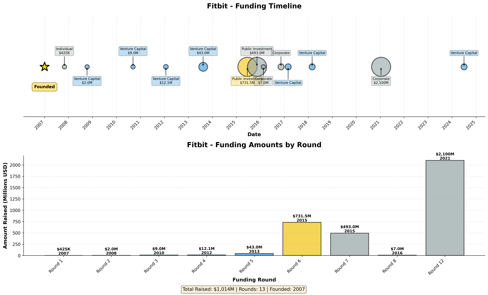

---

## A3.1 Company Overview

| Attribute | Value |
|-----------|-------|
| **Company Name** | Fitbit |
| **Year Founded** | 2007 |
| **Current Age** | 17 years (as of 2024) |
| **Industry** | Consumer Durables |
| **Headquarters** | San Francisco, CA |
| **Website** | www.fitbit.com |
| **Employees** | 1764 (as of 10/03/2020) |

**Description**: Developer of digital health and fitness devices designed to track fitness level and health.

---

## A3.2 Financing Summary

| Metric | Value |
|--------|-------|
| **First Financing Date** | 10/31/2007 |
| **Time to First Financing** | 10 months |
| **First Deal Type** | Angel (individual) |
| **First Deal Size** | $425K |
| **Total Capital Raised** | $1,014M |
| **Number of Rounds** | 13 |
| **Current Status** | Venture Capital-Backed |
| **Business Status** | Generating Revenue |

---

## A3.3 Financing History

| Round | Date | Deal Type | Deal Class | Amount | Pre-Money | Post-Money |
|-------|------|-----------|------------|---------|-----------|------------|
| 1 | 10/31/2007 | Angel (individual) | Individual | $425K | $625K | $1.1M |
| 2 | 10/10/2008 | Early Stage VC | Venture Capital | $2.0M | $5.8M | $7.8M |
| 3 | 09/10/2010 | Early Stage VC | Venture Capital | $9.0M | $21.8M | $30.8M |
| 4 | 01/24/2012 | Later Stage VC | Venture Capital | $12.1M | $44.2M | $56.2M |
| 5 | 08/13/2013 | Later Stage VC | Venture Capital | $43.0M | $300.9M | $343.9M |
| 6 | 06/18/2015 | IPO | Public Investment | $731.5M | $3,667M | $4,114M |
| 7 | 11/12/2015 | Public Investment 2nd Offering | Public Investment | $493.0M | N/A | N/A |
| 8 | 02/17/2016 | PIPE | Corporate | $7.0M | N/A | N/A |
| 9 | 11/11/2016 | Merger/Acquisition | Corporate | N/A | N/A | N/A |
| 10 | 02/28/2017 | Secondary Transaction - Open Market | Venture Capital | N/A | N/A | N/A |
| 11 | 03/01/2018 | Secondary Transaction - Open Market | Venture Capital | N/A | N/A | N/A |
| 12 | 01/14/2021 | Merger/Acquisition | Corporate | $2,100M | N/A | $2,100M |
| 13 | 07/01/2024 | Later Stage VC | Venture Capital | N/A | N/A | N/A |

---

## A3.4 Valuation

| Metric | Value |
|--------|-------|
| **First Valuation** | $1.1M |
| **Last Known Valuation** | $2,100M |
| **Last Valuation Date** | 01/14/2021 |

---

## A3.5 Exit Events

| Attribute | Value |
|-----------|-------|
| **Exit Event** | Yes (Acquisition) |
| **Exit Details** | Acquired by Alphabet (Google) for $2.1B (01/14/2021). Previously IPO'd in 2015. |
| **Ownership Status** | Privately Held (backing) |

---

## A3.6 Investment & Acquisition Activity

| Attribute | Value |
|-----------|-------|
| **Active as Investor/Acquirer** | Yes (Investor) |
| **Summary** | 10 investments, 2 active, 6 acquisitions |
| **Investor Type** | VC-Backed Company |
| **Total Investments** | 10 |
| **Active Portfolio** | 2 companies |
| **Last Investment** | Juicy Marbles (11/24/2021) |

### Acquisitions Made (Top 10)

| # | Target Company | Date | Amount |
|---|----------------|------|--------|
| 1 | Doki Technologies | 05/10/2020 | N/A |
| 2 | Twine Health | 02/01/2018 | $16.7M |
| 3 | Coin | 05/12/2016 | $7.0M |
| 4 | Vector Watch | 01/10/2017 | $15.0M |
| 5 | Pebble Watch | 12/06/2016 | $23.4M |
| 6 | FitStar Labs | 03/05/2015 | $32.5M |

---

## A3.7 Key Investors

| Investors (by round) |
|---------------------|
| 3 |
| 5 |
| 4 |
| 1 |
| 2 |
| 10 |

---

# Appendix 4: Flow Neuroscience

**Company ID**: 183205-63
**Visualization**:

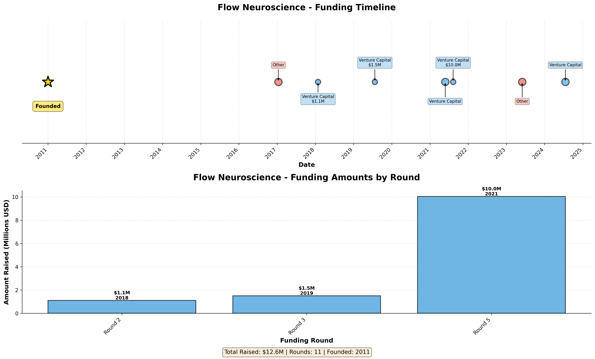

---

## A4.1 Company Overview

| Attribute | Value |
|-----------|-------|
| **Company Name** | Flow Neuroscience |
| **Year Founded** | 2011 |
| **Current Age** | 13 years (as of 2024) |
| **Industry** | Healthcare Devices and Supplies |
| **Headquarters** | Malmö, Sweden |
| **Website** | www.flowneuroscience.com |
| **Employees** | 33 (as of 10/03/2024) |

**Description**: Developer of a brain stimulation headset designed to target both the physical and behavioral elements of major depressive disorder.

---

## A4.2 Financing Summary

| Metric | Value |
|--------|-------|
| **First Financing Date** | N/A |
| **Time to First Financing** | N/A |
| **First Deal Type** | Grant |
| **First Deal Size** | N/A |
| **Total Capital Raised** | $12.6M |
| **Number of Rounds** | 11 |
| **Current Status** | Venture Capital-Backed |
| **Business Status** | Generating Revenue |

---

## A4.3 Financing History

| Round | Date | Deal Type | Deal Class | Amount | Pre-Money | Post-Money |
|-------|------|-----------|------------|---------|-----------|------------|
| 1 | N/A | Grant | Other | N/A | N/A | N/A |
| 2 | N/A | Grant | Other | N/A | N/A | N/A |
| 3 | N/A | Accelerator/Incubator | Other | N/A | N/A | N/A |
| 4 | N/A | Accelerator/Incubator | Other | N/A | N/A | N/A |
| 5 | 01/12/2017 | Accelerator/Incubator | Other | N/A | N/A | N/A |
| 6 | 01/26/2018 | Seed Round | Venture Capital | $1.1M | N/A | N/A |
| 7 | 07/23/2019 | Early Stage VC | Venture Capital | $1.5M | N/A | N/A |
| 8 | 05/26/2021 | Later Stage VC | Venture Capital | N/A | N/A | N/A |
| 9 | 08/10/2021 | Later Stage VC | Venture Capital | $10.0M | N/A | N/A |
| 10 | 06/01/2023 | Accelerator/Incubator | Other | N/A | N/A | N/A |
| 11 | 07/18/2024 | Later Stage VC | Venture Capital | N/A | N/A | N/A |

---

## A4.4 Valuation

| Metric | Value |
|--------|-------|
| **First Valuation** | N/A |
| **Last Known Valuation** | N/A |
| **Last Valuation Date** | N/A |

---

## A4.5 Exit Events

| Attribute | Value |
|-----------|-------|
| **Exit Event** | No |
| **Exit Details** |  |
| **Ownership Status** | Privately Held (backing) |

---

## A4.6 Investment & Acquisition Activity

| Attribute | Value |
|-----------|-------|
| **Active as Investor/Acquirer** | Yes (Investor) |
| **Summary** | 1 investments,  active, 1 acquisitions |
| **Investor Type** | VC-Backed Company |
| **Total Investments** | 1 |
| **Active Portfolio** |  companies |
| **Last Investment** | Halo (Therapeutic Devices) (02/05/2021) |

### Acquisitions Made (Top 10)

| # | Target Company | Date | Amount |
|---|----------------|------|--------|
| 1 | Halo (Therapeutic Devices) | 02/05/2021 | N/A |

---

## A4.7 Key Investors

| Investors (by round) |
|---------------------|
| 3 |
| 4 |
| 1 |
| 2 |
| 9 |

---

# Appendix 5: GOQii

**Company ID**: 65652-22
**Visualization**:

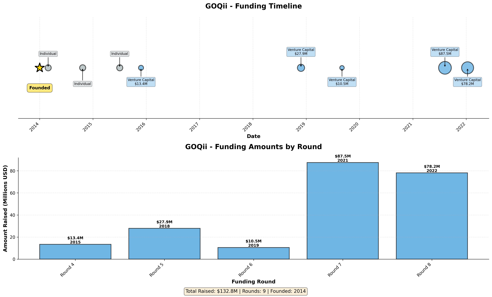

---

## A5.1 Company Overview

| Attribute | Value |
|-----------|-------|
| **Company Name** | GOQii |
| **Year Founded** | 2014 |
| **Current Age** | 10 years (as of 2024) |
| **Industry** | Healthcare Services |
| **Headquarters** | Redwood City, CA |
| **Website** | www.goqii.com |
| **Employees** | 268 (as of 03/30/2022) |

**Description**: Developer of a fitness device designed to improve health and increase longevity.

---

## A5.2 Financing Summary

| Metric | Value |
|--------|-------|
| **First Financing Date** | 02/28/2014 |
| **Time to First Financing** | 2 months |
| **First Deal Type** | Angel (individual) |
| **First Deal Size** | N/A |
| **Total Capital Raised** | $132.8M |
| **Number of Rounds** | 9 |
| **Current Status** | Venture Capital-Backed |
| **Business Status** | Generating Revenue |

---

## A5.3 Financing History

| Round | Date | Deal Type | Deal Class | Amount | Pre-Money | Post-Money |
|-------|------|-----------|------------|---------|-----------|------------|
| 1 | N/A | Secondary Transaction - Private | Venture Capital | N/A | N/A | N/A |
| 2 | 02/28/2014 | Angel (individual) | Individual | N/A | N/A | N/A |
| 3 | 10/22/2014 | Angel (individual) | Individual | N/A | N/A | N/A |
| 4 | 07/03/2015 | Angel (individual) | Individual | N/A | N/A | N/A |
| 5 | 11/26/2015 | Early Stage VC | Venture Capital | $13.4M | $18.0M | $31.4M |
| 6 | 11/26/2018 | Early Stage VC | Venture Capital | $27.9M | $81.0M | $108.9M |
| 7 | 09/03/2019 | Later Stage VC | Venture Capital | $10.5M | N/A | N/A |
| 8 | 08/08/2021 | Later Stage VC | Venture Capital | $87.5M | N/A | N/A |
| 9 | 01/10/2022 | Later Stage VC | Venture Capital | $78.2M | N/A | N/A |

---

## A5.4 Valuation

| Metric | Value |
|--------|-------|
| **First Valuation** | N/A |
| **Last Known Valuation** | $108.9M |
| **Last Valuation Date** | 11/26/2018 |

---

## A5.5 Exit Events

| Attribute | Value |
|-----------|-------|
| **Exit Event** | No |
| **Exit Details** |  |
| **Ownership Status** | Privately Held (backing) |

---

## A5.6 Investment & Acquisition Activity

| Attribute | Value |
|-----------|-------|
| **Active as Investor/Acquirer** | No |

---

## A5.7 Key Investors

| Investors (by round) |
|---------------------|
| 3 |
| 15 |
| 8 |
| 18 |
| 7 |
| 11 |

---

# Appendix 6: Oura

**Company ID**: 110783-26
**Visualization**:

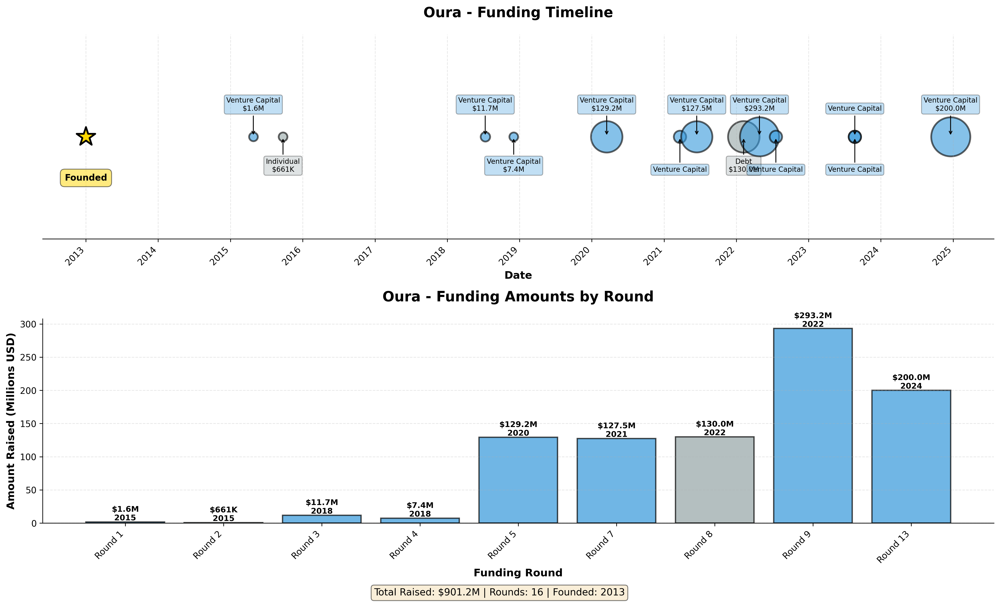

---

## A6.1 Company Overview

| Attribute | Value |
|-----------|-------|
| **Company Name** | Oura |
| **Year Founded** | 2013 |
| **Current Age** | 11 years (as of 2024) |
| **Industry** | Consumer Durables |
| **Headquarters** | Oulu, Finland |
| **Website** | www.ouraring.com |
| **Employees** | 700 (as of 01/18/2025) |

**Description**: Developer of a wellness wearable ring designed to track and improve sleep quality and performance.

---

## A6.2 Financing Summary

| Metric | Value |
|--------|-------|
| **First Financing Date** | 04/27/2015 |
| **Time to First Financing** | 2.3 years |
| **First Deal Type** | Seed Round |
| **First Deal Size** | $1.6M |
| **Total Capital Raised** | $901.2M |
| **Number of Rounds** | 16 |
| **Current Status** | Venture Capital-Backed |
| **Business Status** | Generating Revenue |

---

## A6.3 Financing History

| Round | Date | Deal Type | Deal Class | Amount | Pre-Money | Post-Money |
|-------|------|-----------|------------|---------|-----------|------------|
| 1 | N/A | Grant | Other | $323K | N/A | N/A |
| 2 | N/A | Secondary Transaction - Private | Venture Capital | N/A | N/A | N/A |
| 3 | N/A | Secondary Transaction - Private | Venture Capital | N/A | N/A | N/A |
| 4 | 04/27/2015 | Seed Round | Venture Capital | $1.6M | $5.3M | $6.1M |
| 5 | 09/24/2015 | Equity Crowdfunding | Individual | $661K | $3.7M | $4.3M |
| 6 | 07/12/2018 | Later Stage VC | Venture Capital | $11.7M | $14.6M | $24.8M |
| 7 | 12/03/2018 | Later Stage VC | Venture Capital | $7.4M | $31.3M | $35.2M |
| 8 | 03/17/2020 | Later Stage VC | Venture Capital | $129.2M | $596.0M | $725.2M |
| 9 | 03/22/2021 | Secondary Transaction - Private | Venture Capital | N/A | N/A | N/A |
| 10 | 06/15/2021 | Later Stage VC | Venture Capital | $127.5M | $772.5M | $900.0M |
| 11 | 02/07/2022 | Debt - General | Debt | $130.0M | N/A | N/A |
| 12 | 04/28/2022 | Later Stage VC | Venture Capital | $293.2M | $2,056M | $2,350M |
| 13 | 07/20/2022 | Secondary Transaction - Private | Venture Capital | N/A | N/A | N/A |
| 14 | 08/23/2023 | Secondary Transaction - Private | Venture Capital | N/A | N/A | N/A |
| 15 | 08/23/2023 | Later Stage VC | Venture Capital | N/A | N/A | N/A |
| 16 | 12/19/2024 | Later Stage VC | Venture Capital | $200.0M | $5,000M | $5,200M |

---

## A6.4 Valuation

| Metric | Value |
|--------|-------|
| **First Valuation** | $6.1M |
| **Last Known Valuation** | $5,200M |
| **Last Valuation Date** | 12/19/2024 |

---

## A6.5 Exit Events

| Attribute | Value |
|-----------|-------|
| **Exit Event** | No |
| **Exit Details** |  |
| **Ownership Status** | Privately Held (backing) |

---

## A6.6 Investment & Acquisition Activity

| Attribute | Value |
|-----------|-------|
| **Active as Investor/Acquirer** | Yes (Investor) |
| **Summary** | 3 investments,  active, 26 acquisitions |
| **Investor Type** | VC-Backed Company |
| **Total Investments** | 3 |
| **Active Portfolio** |  companies |
| **Last Investment** | Sparta Science (10/31/2024) |

### Acquisitions Made (Top 10)

| # | Target Company | Date | Amount |
|---|----------------|------|--------|
| 1 | Picaboo | 04/16/2022 | N/A |
| 2 | The Behavioural Insights Team | 12/13/2021 | $20.5M |
| 3 | Silatronix | 11/01/2021 | N/A |
| 4 | CloudSkiff | 10/29/2021 | N/A |
| 5 | Cannabliss & Co. | 01/01/2018 | N/A |
| 6 | Tapit | 08/10/2017 | N/A |
| 7 | CannTx | 10/29/2021 | $11.9M |
| 8 | Predictive Discovery |  | $2.0M |
| 9 | Terradiol | 08/01/2018 | N/A |
| 10 | Avail Support | 02/23/2021 | N/A |

*Plus 16 additional acquisitions*

---

## A6.7 Key Investors

| Investors (by round) |
|---------------------|
| 12 |
| 8 |
| 1 |
| 2 |
| 27 |
| 10 |
| 13 |

---

# Appendix 7: Peloton

**Company ID**: 61931-08
**Visualization**:

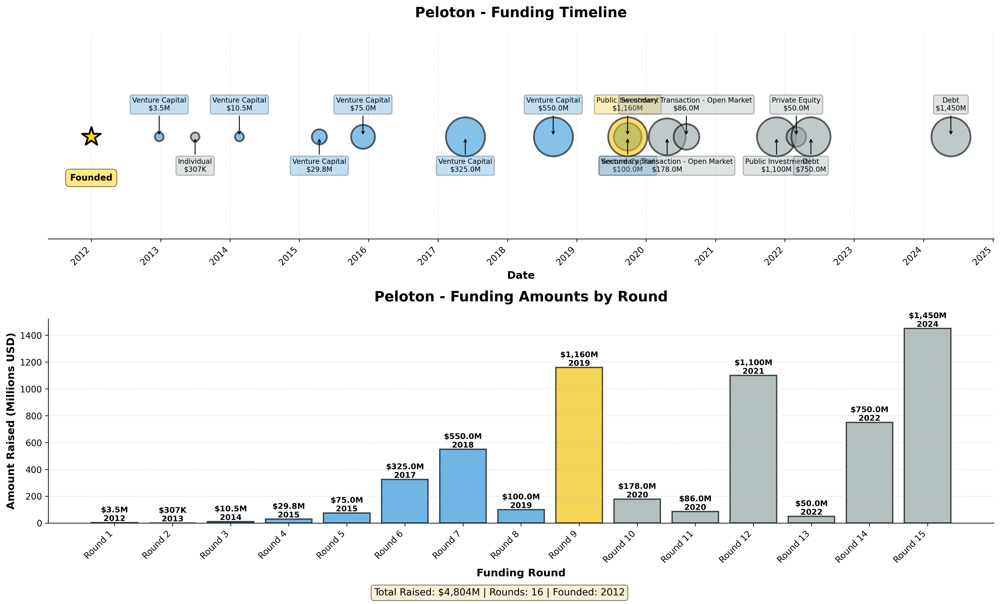

---

## A7.1 Company Overview

| Attribute | Value |
|-----------|-------|
| **Company Name** | Peloton |
| **Year Founded** | 2012 |
| **Current Age** | 12 years (as of 2024) |
| **Industry** | Consumer Durables |
| **Headquarters** | New York, NY |
| **Website** | www.onepeloton.com |
| **Employees** | 2322 (as of 06/30/2024) |

**Description**: Provider of integrated at-home fitness equipment designed to bring boutique fitness into the home.

---

## A7.2 Financing Summary

| Metric | Value |
|--------|-------|
| **First Financing Date** | 12/24/2012 |
| **Time to First Financing** | 1.0 years |
| **First Deal Type** | Early Stage VC |
| **First Deal Size** | $3.5M |
| **Total Capital Raised** | $4,804M |
| **Number of Rounds** | 16 |
| **Current Status** | Formerly VC-backed |
| **Business Status** | Generating Revenue/Not Profitable |

---

## A7.3 Financing History

| Round | Date | Deal Type | Deal Class | Amount | Pre-Money | Post-Money |
|-------|------|-----------|------------|---------|-----------|------------|
| 1 | N/A | Secondary Transaction - Private | Venture Capital | N/A | N/A | N/A |
| 2 | 12/24/2012 | Early Stage VC | Venture Capital | $3.5M | $14.0M | $17.5M |
| 3 | 07/01/2013 | Product Crowdfunding | Individual | $307K | N/A | N/A |
| 4 | 02/19/2014 | Early Stage VC | Venture Capital | $10.5M | $25.0M | $35.5M |
| 5 | 04/16/2015 | Later Stage VC | Venture Capital | $29.8M | $56.7M | $86.5M |
| 6 | 12/02/2015 | Later Stage VC | Venture Capital | $75.0M | $260.0M | $335.0M |
| 7 | 05/24/2017 | Later Stage VC | Venture Capital | $325.0M | $925.0M | $1,250M |
| 8 | 08/30/2018 | Later Stage VC | Venture Capital | $550.0M | $3,600M | $4,150M |
| 9 | 09/26/2019 | PIPE | Venture Capital | $100.0M | N/A | N/A |
| 10 | 09/26/2019 | IPO | Public Investment | $1,160M | $6,942M | $8,102M |
| 11 | 04/21/2020 | Secondary Transaction - Open Market | N/A | $178.0M | N/A | N/A |
| 12 | 07/31/2020 | Secondary Transaction - Open Market | N/A | $86.0M | N/A | N/A |
| 13 | 11/18/2021 | Public Investment 2nd Offering | Public Investment | $1,100M | N/A | N/A |
| 14 | 03/02/2022 | Secondary Transaction - Private | Private Equity | $50.0M | N/A | N/A |
| 15 | 05/18/2022 | General Corporate Purpose | Debt | $750.0M | N/A | N/A |
| 16 | 05/24/2024 | Debt Refinancing | Debt | $1,450M | N/A | N/A |

---

## A7.4 Valuation

| Metric | Value |
|--------|-------|
| **First Valuation** | $17.5M |
| **Last Known Valuation** | $8,102M |
| **Last Valuation Date** | 09/26/2019 |

---

## A7.5 Exit Events

| Attribute | Value |
|-----------|-------|
| **Exit Event** | Yes (IPO) |
| **Exit Details** | NAS: PTON |
| **Ownership Status** | Publicly Held |

---

## A7.6 Investment & Acquisition Activity

| Attribute | Value |
|-----------|-------|
| **Active as Investor/Acquirer** | Yes (Investor) |
| **Summary** | 10 investments, 1 active, 25 acquisitions |
| **Investor Type** | Corporation |
| **Total Investments** | 10 |
| **Active Portfolio** | 1 companies |
| **Last Investment** | Envirly (11/29/2023) |

### Acquisitions Made (Top 10)

| # | Target Company | Date | Amount |
|---|----------------|------|--------|
| 1 | Altima Dental Canada | 08/15/2022 | N/A |
| 2 | Grenova | 03/04/2022 | N/A |
| 3 | ZeroFox | 08/04/2022 | $170.0M |
| 4 | Clinique De Fertilite Conceptia Fertility Clinic | 06/21/2021 | N/A |
| 5 | Atlas (Electronics) | 01/01/2020 | N/A |
| 6 | Aiqudo | 02/09/2021 | $57.7M |
| 7 | Otari Mats | 12/14/2020 | N/A |
| 8 | Generation Fertility | 01/13/2021 | N/A |
| 9 | Aurora Reproductive Care | 12/22/2020 | N/A |
| 10 | Airway Oxygen | 09/30/2020 | N/A |

*Plus 15 additional acquisitions*

---

## A7.7 Key Investors

| Investors (by round) |
|---------------------|
| 3 |
| 28 |
| 6 |
| 1 |
| 2 |
| 10 |

---

# Appendix 8: Playermaker

**Company ID**: 142343-92
**Visualization**:

---

## A8.1 Company Overview

| Attribute | Value |
|-----------|-------|
| **Company Name** | Playermaker |
| **Year Founded** | 2016 |
| **Current Age** | 8 years (as of 2024) |
| **Industry** | Consumer Durables |
| **Headquarters** | London, United Kingdom |
| **Website** | www.playermaker.com |
| **Employees** | 76 (as of 03/05/2025) |

**Description**: Operator of a coaching enhancement kit brand intended for football players. The company offers a wearable performance-tracking device that turns footwear into a connected device that captures technical, tactical, biomechanical and physical data from the source of motion, enabling athletes at any level to maximize their skills, monitor injury risk, as well as expedite injury recovery.

---

## A8.2 Financing Summary

| Metric | Value |
|--------|-------|
| **First Financing Date** | 08/01/2018 |
| **Time to First Financing** | 2.0 years |
| **First Deal Type** | Early Stage VC |
| **First Deal Size** | $4.00M |
| **Total Capital Raised** | $40.00M |
| **Number of Rounds** | 7 |
| **Current Status** | Venture Capital-Backed |
| **Business Status** | Generating Revenue |

---

## A8.3 Financing History

| Round | Date | Deal Type | Deal Class | Amount | Pre-Money | Post-Money |
|-------|------|-----------|------------|---------|-----------|------------|
| 1 | 08/01/2018 | Early Stage VC | Venture Capital | $4.00M | $12.11M | $16.11M |
| 2 | 01/01/2019 | Accelerator/Incubator | Other | N/A | N/A | N/A |
| 3 | 05/23/2019 | Early Stage VC | Venture Capital | $2.12M | $19.34M | $21.46M |
| 4 | 12/16/2019 | Early Stage VC | Venture Capital | $10.91M | $35.09M | $46.00M |
| 5 | 06/16/2022 | Later Stage VC | Venture Capital | $20.00M | $59.30M | $79.30M |
| 6 | 10/13/2023 | Later Stage VC | Venture Capital | N/A | N/A | N/A |

---

## A8.4 Valuation

| Metric | Value |
|--------|-------|
| **First Valuation** | $16.11M |
| **Last Known Valuation** | $79.30M |
| **Last Valuation Date** | 06/16/2022 |

---

## A8.5 Exit Events

| Attribute | Value |
|-----------|-------|
| **Exit Event** | No |
| **Exit Details** |  |
| **Ownership Status** | Privately Held (backing) |

---

## A8.6 Investment & Acquisition Activity

| Attribute | Value |
|-----------|-------|
| **Active as Investor/Acquirer** | No |

---

## A8.7 Key Investors

| Investors (by round) |
|---------------------|
| 1 |
| 2 |
| 3 |
| 4 |
| 5 |
| 6 |

---

# Appendix 9: Pulsetto

**Company ID**: 495718-39
**Visualization**:

---

## A9.1 Company Overview

| Attribute | Value |
|-----------|-------|
| **Company Name** | Pulsetto |
| **Year Founded** | 2021 |
| **Current Age** | 3 years (as of 2024) |
| **Industry** | Healthcare Devices and Supplies |
| **Headquarters** | Vilnius, Lithuania |
| **Website** | www.pulsetto.tech |
| **Employees** | 28 (as of 02/21/2025) |

**Description**: Developer of neuromodulation devices dedicated to improving lives through neuroscience.

---

## A9.2 Financing Summary

| Metric | Value |
|--------|-------|
| **First Financing Date** | 01/01/2021 |
| **Time to First Financing** | 1 months |
| **First Deal Type** | Corporate |
| **First Deal Size** | $608K |
| **Total Capital Raised** | $3.7M |
| **Number of Rounds** | 6 |
| **Current Status** | Venture Capital-Backed |
| **Business Status** | Generating Revenue |

---

## A9.3 Financing History

| Round | Date | Deal Type | Deal Class | Amount | Pre-Money | Post-Money |
|-------|------|-----------|------------|---------|-----------|------------|
| 1 | 01/01/2021 | Corporate | Corporate | $608K | N/A | N/A |
| 2 | 04/12/2022 | Corporate | Corporate | $220K | N/A | N/A |
| 3 | 04/28/2022 | Corporate | Corporate | $326K | N/A | N/A |
| 4 | 01/01/2023 | Accelerator/Incubator | Other | N/A | N/A | N/A |
| 5 | 02/17/2025 | Angel (individual) | Individual | $416K | $20.4M | $20.8M |
| 6 | 02/21/2025 | Early Stage VC | Venture Capital | $2.1M | N/A | N/A |

---

## A9.4 Valuation

| Metric | Value |
|--------|-------|
| **First Valuation** | N/A |
| **Last Known Valuation** | $20.8M |
| **Last Valuation Date** | 02/17/2025 |

---

## A9.5 Exit Events

| Attribute | Value |
|-----------|-------|
| **Exit Event** | No |
| **Exit Details** |  |
| **Ownership Status** | Privately Held (backing) |

---

## A9.6 Investment & Acquisition Activity

| Attribute | Value |
|-----------|-------|
| **Active as Investor/Acquirer** | No |

---

## A9.7 Key Investors

| Investors (by round) |
|---------------------|
| 1 |

---

# Appendix 10: ThingX

**Company ID**: 697387-24
**Visualization**:

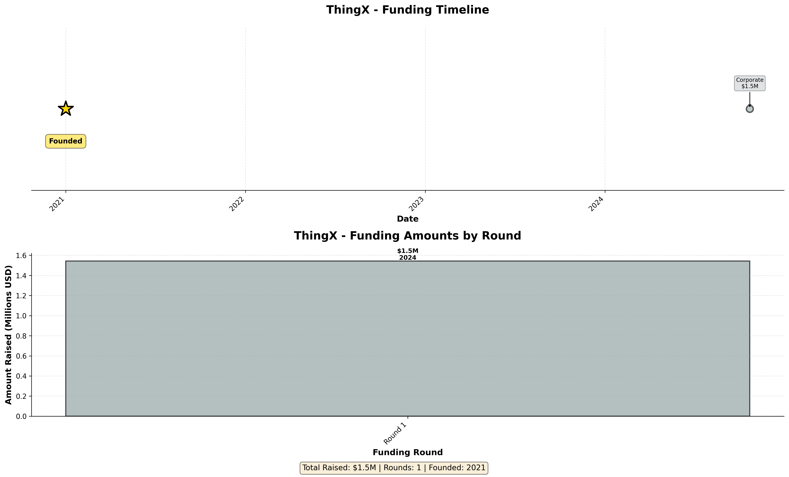

---

## A10.1 Company Overview

| Attribute | Value |
|-----------|-------|
| **Company Name** | ThingX |
| **Year Founded** | 2021 |
| **Current Age** | 3 years (as of 2024) |
| **Industry** | Healthcare Devices and Supplies |
| **Headquarters** | Hong Kong, Hong Kong |
| **Website** | www.thingx.ai |
| **Employees** | 20 (as of 05/09/2024) |

**Description**: Developer of Artificial Intelligence technology designed to enhance the smart healthcare industry.

---

## A10.2 Financing Summary

| Metric | Value |
|--------|-------|
| **First Financing Date** | 10/21/2024 |
| **Time to First Financing** | 3.8 years |
| **First Deal Type** | Early Stage VC |
| **First Deal Size** | $1.5M |
| **Total Capital Raised** | $1.5M |
| **Number of Rounds** | 1 |
| **Current Status** | Venture Capital-Backed |
| **Business Status** | Generating Revenue |

---

## A10.3 Financing History

| Round | Date | Deal Type | Deal Class | Amount | Pre-Money | Post-Money |
|-------|------|-----------|------------|---------|-----------|------------|
| 1 | 10/21/2024 | Early Stage VC | Corporate | $1.5M | N/A | N/A |

---

## A10.4 Valuation

| Metric | Value |
|--------|-------|
| **First Valuation** | N/A |
| **Last Known Valuation** | N/A |
| **Last Valuation Date** | N/A |

---

## A10.5 Exit Events

| Attribute | Value |
|-----------|-------|
| **Exit Event** | No |
| **Exit Details** |  |
| **Ownership Status** | Privately Held (backing) |

---

## A10.6 Investment & Acquisition Activity

| Attribute | Value |
|-----------|-------|
| **Active as Investor/Acquirer** | No |

---

## A10.7 Key Investors

| Investors (by round) |
|---------------------|
| 1 |

---

# Appendix 11: Ultrahuman

**Company ID**: 458417-44
**Visualization**:

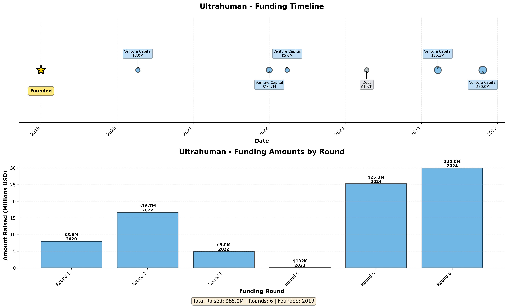

---

## A11.1 Company Overview

| Attribute | Value |
|-----------|-------|
| **Company Name** | Ultrahuman |
| **Year Founded** | 2019 |
| **Current Age** | 5 years (as of 2024) |
| **Industry** | Healthcare Devices and Supplies |
| **Headquarters** | Bangalore, India |
| **Website** | www.ultrahuman.com |
| **Employees** | 125 (as of 03/20/2024) |

**Description**: Developer of metabolic health and fitness monitoring devices intended to help users transform themselves easily.

---

## A11.2 Financing Summary

| Metric | Value |
|--------|-------|
| **First Financing Date** | 04/10/2020 |
| **Time to First Financing** | 1.3 years |
| **First Deal Type** | Early Stage VC |
| **First Deal Size** | $8.0M |
| **Total Capital Raised** | $85.0M |
| **Number of Rounds** | 6 |
| **Current Status** | Venture Capital-Backed |
| **Business Status** | Generating Revenue |

---

## A11.3 Financing History

| Round | Date | Deal Type | Deal Class | Amount | Pre-Money | Post-Money |
|-------|------|-----------|------------|---------|-----------|------------|
| 1 | 04/10/2020 | Early Stage VC | Venture Capital | $8.0M | $14.9M | $22.2M |
| 2 | 01/01/2022 | Early Stage VC | Venture Capital | $16.7M | $33.1M | $49.8M |
| 3 | 03/28/2022 | Early Stage VC | Venture Capital | $5.0M | $74.2M | $79.2M |
| 4 | 04/14/2023 | Debt - General | Debt | $102K | N/A | N/A |
| 5 | 03/20/2024 | Later Stage VC | Venture Capital | $25.3M | $100.2M | $125.5M |
| 6 | 10/22/2024 | Later Stage VC | Venture Capital | $30.0M | N/A | N/A |

---

## A11.4 Valuation

| Metric | Value |
|--------|-------|
| **First Valuation** | $22.2M |
| **Last Known Valuation** | $125.5M |
| **Last Valuation Date** | 03/20/2024 |

---

## A11.5 Exit Events

| Attribute | Value |
|-----------|-------|
| **Exit Event** | No |
| **Exit Details** |  |
| **Ownership Status** | Privately Held (backing) |

---

## A11.6 Investment & Acquisition Activity

| Attribute | Value |
|-----------|-------|
| **Active as Investor/Acquirer** | Yes (Investor) |
| **Summary** | 2 investments, 1 active, 1 acquisitions |
| **Investor Type** | Corporation |
| **Total Investments** | 2 |
| **Active Portfolio** | 1 companies |
| **Last Investment** | Punch (08/06/2024) |

### Acquisitions Made (Top 10)

| # | Target Company | Date | Amount |
|---|----------------|------|--------|
| 1 | Lazy Co. | 04/12/2022 | N/A |

---

## A11.7 Key Investors

| Investors (by round) |
|---------------------|
| 3 |
| 5 |
| 21 |
| 1 |
| 7 |

---

# Appendix 12: Whoop

**Company ID**: 64325-80
**Visualization**:

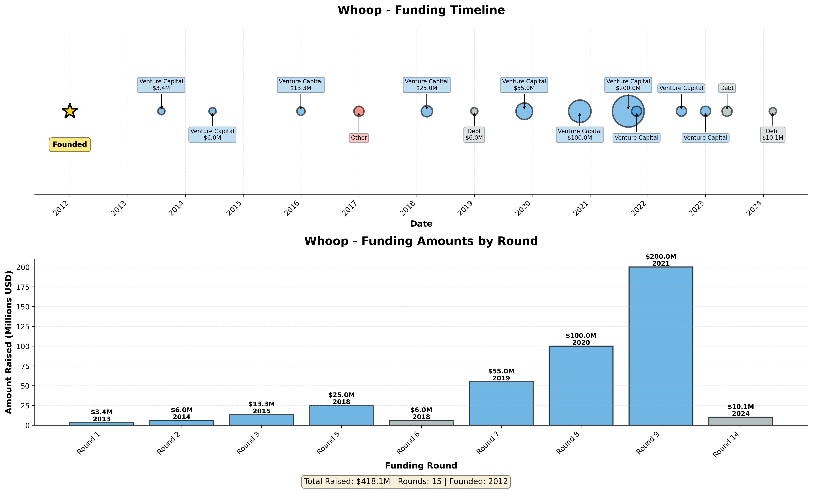

---

## A12.1 Company Overview

| Attribute | Value |
|-----------|-------|
| **Company Name** | Whoop |
| **Year Founded** | 2012 |
| **Current Age** | 12 years (as of 2024) |
| **Industry** | Healthcare Devices and Supplies |
| **Headquarters** | Boston, MA |
| **Website** | www.whoop.com |
| **Employees** | 939 (as of 12/17/2024) |

**Description**: Developer of a wearable performance optimization device intended to provide personalized insights to improve overall fitness.

---

## A12.2 Financing Summary

| Metric | Value |
|--------|-------|
| **First Financing Date** | N/A |
| **Time to First Financing** | N/A |
| **First Deal Type** | Accelerator/Incubator |
| **First Deal Size** | N/A |
| **Total Capital Raised** | $418.1M |
| **Number of Rounds** | 15 |
| **Current Status** | Venture Capital-Backed |
| **Business Status** | Generating Revenue |

---

## A12.3 Financing History

| Round | Date | Deal Type | Deal Class | Amount | Pre-Money | Post-Money |
|-------|------|-----------|------------|---------|-----------|------------|
| 1 | N/A | Accelerator/Incubator | Other | N/A | N/A | N/A |
| 2 | 08/01/2013 | Seed Round | Venture Capital | $3.4M | $7.4M | $10.8M |
| 3 | 06/20/2014 | Early Stage VC | Venture Capital | $6.0M | $17.5M | $23.5M |
| 4 | 12/31/2015 | Early Stage VC | Venture Capital | $13.3M | $35.0M | $48.3M |
| 5 | 01/01/2017 | Accelerator/Incubator | Other | N/A | N/A | N/A |
| 6 | 03/06/2018 | Later Stage VC | Venture Capital | $25.0M | $100.0M | $125.0M |
| 7 | 12/31/2018 | Mezzanine | Debt | $6.0M | N/A | N/A |
| 8 | 11/12/2019 | Later Stage VC | Venture Capital | $55.0M | $200.0M | $237.4M |
| 9 | 10/28/2020 | Later Stage VC | Venture Capital | $100.0M | $1,100M | $1,200M |
| 10 | 08/30/2021 | Later Stage VC | Venture Capital | $200.0M | $3,400M | $3,600M |
| 11 | 10/22/2021 | Secondary Transaction - Private | Venture Capital | N/A | N/A | N/A |
| 12 | 08/01/2022 | Later Stage VC | Venture Capital | N/A | N/A | N/A |
| 13 | 01/01/2023 | Later Stage VC | Venture Capital | N/A | N/A | N/A |
| 14 | 05/17/2023 | Debt - General | Debt | N/A | N/A | N/A |
| 15 | 03/01/2024 | Debt - General | Debt | $10.1M | N/A | N/A |

---

## A12.4 Valuation

| Metric | Value |
|--------|-------|
| **First Valuation** | N/A |
| **Last Known Valuation** | $3,600M |
| **Last Valuation Date** | 08/30/2021 |

---

## A12.5 Exit Events

| Attribute | Value |
|-----------|-------|
| **Exit Event** | No |
| **Exit Details** |  |
| **Ownership Status** | Privately Held (backing) |

---

## A12.6 Investment & Acquisition Activity

| Attribute | Value |
|-----------|-------|
| **Active as Investor/Acquirer** | Yes (Investor) |
| **Summary** | 2 investments,  active, 4 acquisitions |
| **Investor Type** | VC-Backed Company |
| **Total Investments** | 2 |
| **Active Portfolio** |  companies |
| **Last Investment** | AnyQuestion (11/30/2023) |

### Acquisitions Made (Top 10)

| # | Target Company | Date | Amount |
|---|----------------|------|--------|
| 1 | PUSH (Electronic Equipment and Instruments) | 09/02/2021 | N/A |
| 2 | Touchfone | 12/19/2016 | N/A |
| 3 | AnyQuestion | 11/30/2023 | N/A |
| 4 | XOsphere | 09/23/2008 | N/A |

---

## A12.7 Key Investors

| Investors (by round) |
|---------------------|
| 3 |
| 12 |
| 5 |
| 8 |
| 1 |
| 9 |
| 19 |
| 16 |
| 10 |

---

# Appendix 13: Zepp Health

**Company ID**: 100191-79
**Visualization**:

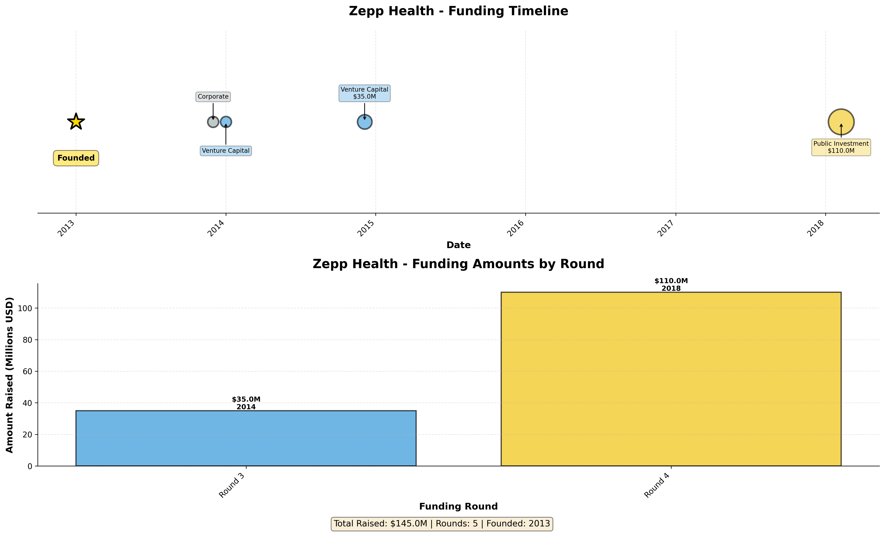

---

## A13.1 Company Overview

| Attribute | Value |
|-----------|-------|
| **Company Name** | Zepp Health |
| **Year Founded** | 2013 |
| **Current Age** | 11 years (as of 2024) |
| **Industry** | Healthcare Devices and Supplies |
| **Headquarters** | Hefei, China |
| **Website** | www.zepp.com |
| **Employees** | 493 (as of 12/31/2023) |

**Description**: Manufacturer of fitness tracking wearables designed to connect biomechanical signals and daily activities with smart data services.

---

## A13.2 Financing Summary

| Metric | Value |
|--------|-------|
| **First Financing Date** | 12/01/2013 |
| **Time to First Financing** | 1.0 years |
| **First Deal Type** | Joint Venture |
| **First Deal Size** | N/A |
| **Total Capital Raised** | $145.0M |
| **Number of Rounds** | 5 |
| **Current Status** | Formerly VC-backed |
| **Business Status** | Generating Revenue/Not Profitable |

---

## A13.3 Financing History

| Round | Date | Deal Type | Deal Class | Amount | Pre-Money | Post-Money |
|-------|------|-----------|------------|---------|-----------|------------|
| 1 | N/A | Secondary Transaction - Open Market | Private Equity | N/A | N/A | N/A |
| 2 | 12/01/2013 | Joint Venture | Corporate | N/A | N/A | N/A |
| 3 | 01/01/2014 | Early Stage VC | Venture Capital | N/A | N/A | N/A |
| 4 | 12/05/2014 | Early Stage VC | Venture Capital | $35.0M | $265.0M | $300.0M |
| 5 | 02/08/2018 | IPO | Public Investment | $110.0M | $543.8M | $653.8M |

---

## A13.4 Valuation

| Metric | Value |
|--------|-------|
| **First Valuation** | N/A |
| **Last Known Valuation** | $653.8M |
| **Last Valuation Date** | 02/08/2018 |

---

## A13.5 Exit Events

| Attribute | Value |
|-----------|-------|
| **Exit Event** | Yes (IPO) |
| **Exit Details** | NYS: ZEPP |
| **Ownership Status** | Publicly Held |

---

## A13.6 Investment & Acquisition Activity

| Attribute | Value |
|-----------|-------|
| **Active as Investor/Acquirer** | Yes (Investor) |
| **Summary** | 17 investments, 9 active |
| **Investor Type** | Corporation |
| **Total Investments** | 17 |
| **Active Portfolio** | 9 companies |
| **Last Investment** | Promaxo (07/10/2024) |

---

## A13.7 Key Investors

| Investors (by round) |
|---------------------|
| 5 |
| 2 |

---

---

## Appendix: Data Dictionary

### Company Information Fields
- **Company ID**: Unique PitchBook identifier
- **Year Founded**: Year the company was established
- **Current Age**: Years since founding (as of 2024)
- **Industry**: Primary industry classification
- **Headquarters**: Main office location
- **Employees**: Employee count with date

### Financing Fields
- **First Financing Date**: Date of initial funding round
- **Time to First Financing**: Duration from founding to first funding
- **Total Capital Raised**: Sum of all disclosed funding amounts
- **Number of Rounds**: Count of financing events
- **Deal Type**: Category of financing (VC, Angel, IPO, etc.)
- **Deal Class**: Sub-category (Venture Capital, Corporate, etc.)

### Valuation Fields
- **Pre-Money Valuation**: Company value before funding round
- **Post-Money Valuation**: Company value after funding round
- **First Valuation**: Valuation at first financing
- **Last Known Valuation**: Most recent company valuation

### Exit Event Types
- **IPO**: Initial Public Offering
- **Acquisition**: Purchase by another company
- **Merger**: Combination with another entity
- **Out of Business**: Company ceased operations

### Investment Activity
- **Active as Investor**: Whether company makes investments in others
- **Total Investments**: Count of investments made
- **Active Portfolio**: Current number of portfolio companies
- **Acquisitions Made**: Companies acquired by subject company

---

## Methodology

### Data Collection
1. **Company Selection**: 14 companies identified from provided company list
2. **Data Extraction**: Automated extraction from PitchBook CSV databases
3. **Data Processing**: Python scripts for analysis and report generation
4. **Validation**: Cross-reference of deal dates, amounts, and valuations

### Analysis Approach
1. **Financing Analysis**: Complete timeline of funding rounds
2. **Valuation Tracking**: Pre and post-money valuations across rounds
3. **Exit Event Identification**: Detection of IPO, acquisition, or closure events
4. **Investment Activity**: Identification of companies acting as investors/acquirers

### Data Quality Notes
- **Missing Data**: Indicated as "N/A" throughout reports
- **Estimated Values**: Some valuations and deal sizes are estimates
- **Date Formats**: Standardized to MM/DD/YYYY format
- **Currency**: All amounts converted to USD millions

---

## Contact & Usage

**Report Generated By**: Company Profiles Analysis System
**Date**: {datetime.now().strftime('%B %d, %Y')}
**Version**: 1.0

**For questions or clarifications**:
- Refer to individual appendices for detailed company information
- See APPENDIX_INDEX.md for quick reference table
- Visualization charts available in /visualizations/ directory

---

*End of Report*
